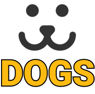

    
    
 Dogs é uma aplicação criada no curso de React Completo da Origamid.

 

<h2>Overview</h2>

A ideia do Dogs é ser uma rede social para cachorros, o projeto foi criado no curso React Completo da Origamid. É usado o ReactJS puro com a biblioteca Victory para apresentar graficos.

<h2>Tecnologias usadas</h2>
<ul>
    <li><a href="https://create-react-app.dev/" target="_blank">React</a></li>
    <li><a href="https://reactrouter.com/" target="_blank">React Router</a></li>
    <li><a href="https://github.com/FormidableLabs/victory" target="_blank">Victory</a></li>
</ul>

<h2>Como baixar o projeto</h2>

    Clone do repositório
    $ git clone https://github.com/saviobarbosa/dogs.git

    Instalação das dependências
    $ npm install

    Inicie o projeto
    $ npm start

 
Projeto criado por Sávio Barbosa!
